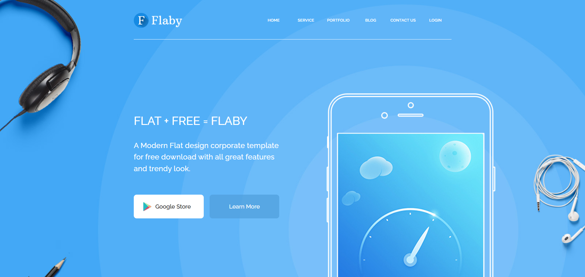

# Landung-page Flaby

Адаптивный сайт Flaby. Создавался для практики вёрстки на чистых HTML+CSS+Js. Слайдер сделан с помощью плагина slick slider.


## Ссылка на сайт

https://duglas43.github.io/Flaby/


## Как запустить локально.

Клонируйте проект

```bash
  git clone https://github.com/duglas43/Flaby.git
```

Перейдите в директорию проекта

```bash
  cd my-project
```

Установите зависимости

```bash
  npm install
```

Запустите сервер

```bash
  npm run start
```


## Что узнал

Научился создавать семантически правильную разметку страницы с использованием методологии БЭМ, стилизовать сайт с помощью css.Научился создавать адаптивную вёрстку с использованием @media запросов, без использования сторонних библиотек.
## Скриншот



